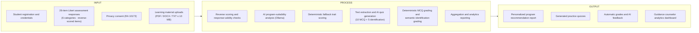

# Method Diagram — Input, Process, Output (Conceptual Framework)

```mermaid
flowchart LR
    subgraph IN["INPUT"]
        A1["Student registration and credentials"]
        A2["26-item Likert assessment responses<br/>(6 categories · reverse-scored items)"]
        A3["Privacy consent (RA 10173)"]
        A4["Learning material uploads<br/>(PDF / DOCX / TXT ≤ 10 MB)"]
    end

    subgraph PR["PROCESS"]
        P1["Reverse scoring and response-validity checks"]
        P2["AI program-suitability analysis (Ollama)"]
        P3["Deterministic fallback trait scoring"]
        P4["Text extraction and AI quiz generation<br/>(10 MCQ + 5 identification)"]
        P5["Deterministic MCQ grading and<br/>semantic identification grading"]
        P6["Aggregation and analytics reporting"]
    end

    subgraph OUT["OUTPUT"]
        O1["Personalized program recommendation report"]
        O2["Generated practice quizzes"]
        O3["Automatic grades and AI feedback"]
        O4["Guidance counselor analytics dashboard"]
    end

    IN --> PR --> OUT
```